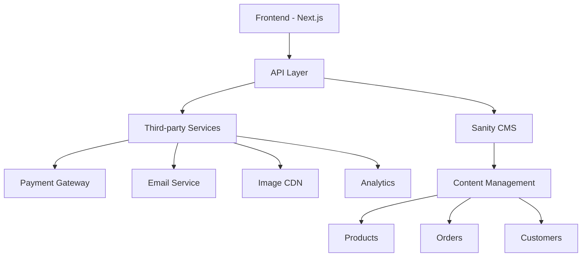
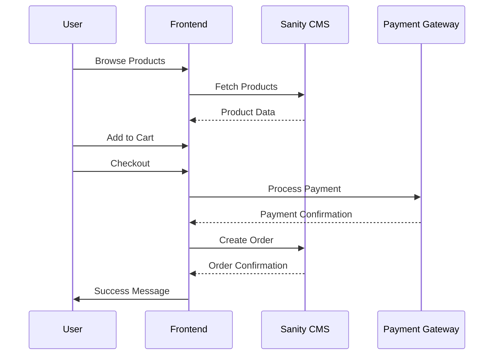
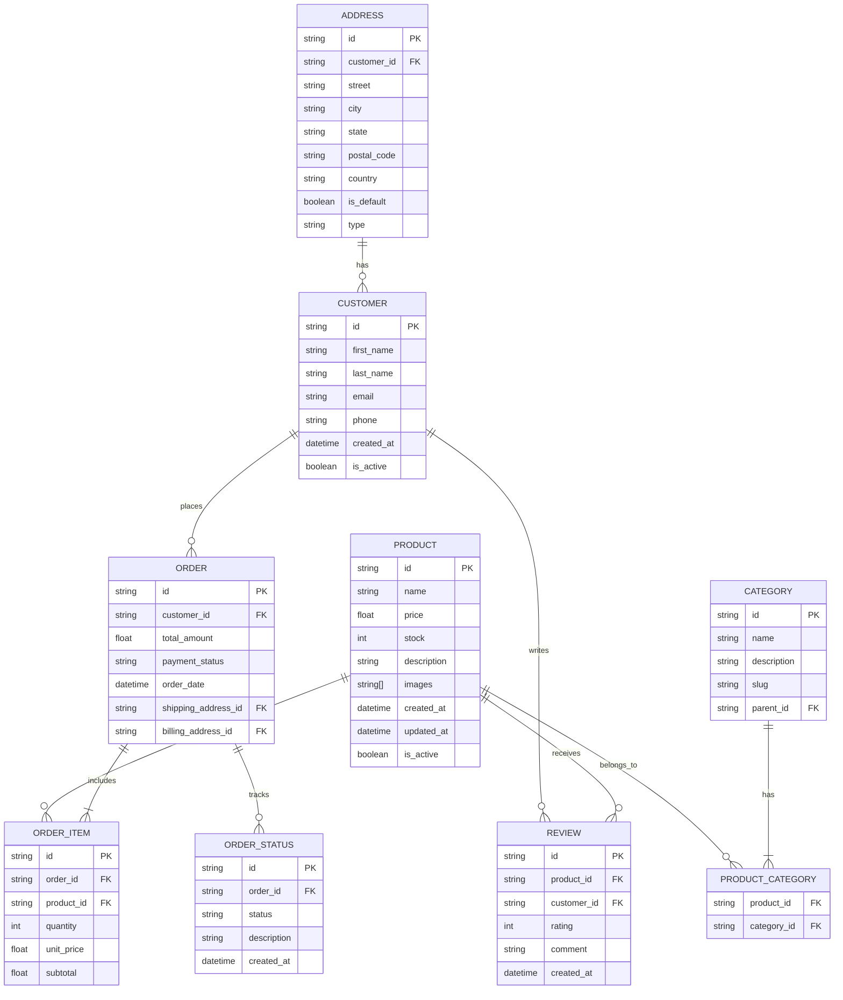

# **Hackathon 3 Documents Day1 / Day2**

# General E-commerce Marketplace Technical Foundation
**Prepared Date:** January 16, 2025   by: Azmat Ali

## 📌 1. Technical Plan Aligned with Business Goals

### 🌟 Business Objectives 🌟
- Create a scalable e-commerce platform
- Provide seamless shopping experience
- Enable efficient product management
- Ensure secure payment processing
- Implement order tracking and management

### 🌟 Technical Requirements 🌟

#### 🌟 Frontend Requirements
- Next.js-based responsive web application
- Server-side rendering for improved SEO
- Client-side state management using React Context/Redux
- Progressive Web App (PWA) capabilities
- Responsive design breakpoints: Mobile (< 768px), Tablet (768px - 1024px), Desktop (> 1024px)

#### 🌟 Backend Requirements (Sanity CMS) 🌟
- Content management for products, categories, and orders
- Real-time inventory tracking
- Order management system
- Customer data management
- Role-based access control

#### 🌟 Third-party Integrations 🌟
- Payment Gateway (Stripe)
- Email Service (SendGrid)
- Image CDN (Cloudinary)
- Analytics (Google Analytics)
- Search Implementation (Algolia)
  
 ### 🌟🌟🌟 E-Commerce Work Process By Image 🌟🌟🌟

  
  

## 📌 2. System Architecture

### 🌟🌟🌟 High-Level Architecture Diagram 🌟🌟🌟


### 🌟 Core Workflows 🌟

#### 🌟🌟🌟 Product Browse & Purchase Flow 🌟🌟🌟


## 📌 3. API Requirements

### 🌟🌟🌟 Product Management APIs 🌟🌟🌟

| Endpoint            | Method |    Description     |               Request/Response                       |
|-------------------- |--------|--------------------|------------------------------------------------------|
| `/api/products`     | GET    | Fetch all products | Response: `{ products: [{id, name, price, stock}] }` |
| `/api/products/:id` | GET    | Get single product | Response: `{ id, name, price, description, stock }`  |
| `/api/categories`   | GET    | Fetch categories   | Response: `{ categories: [{id, name, products}] }`   |
| `/api/orders`       | POST   | Create order       | Request: `{ items, customer, payment }`              |
| `/api/orders/:id`   | GET    | Get order status   | Response: `{ id, status, items, tracking }`          |

## 📌 4. Sanity Schemas

### 🌟🌟🌟 Product Schema 🌟🌟🌟
```javascript
export default {
  name: 'product',
  title: 'Product',
  type: 'document',
  fields: [
    {
      name: 'name',
      title: 'Name',
      type: 'string',
      validation: Rule => Rule.required()
    },
    {
      name: 'slug',
      title: 'Slug',
      type: 'slug',
      options: {
        source: 'name'
      }
    },
    {
      name: 'price',
      title: 'Price',
      type: 'number',
      validation: Rule => Rule.required().positive()
    },
    {
      name: 'description',
      title: 'Description',
      type: 'text'
    },
    {
      name: 'images',
      title: 'Images',
      type: 'array',
      of: [{ type: 'image' }]
    },
    {
      name: 'category',
      title: 'Category',
      type: 'reference',
      to: [{ type: 'category' }]
    },
    {
      name: 'stock',
      title: 'Stock',
      type: 'number',
      validation: Rule => Rule.required().min(0)
    }
  ]
}
```

### 🌟🌟🌟 Order Schema 🌟🌟🌟
```javascript
export default {
  name: 'order',
  title: 'Order',
  type: 'document',
  fields: [
    {
      name: 'orderNumber',
      title: 'Order Number',
      type: 'string',
      validation: Rule => Rule.required()
    },
    {
      name: 'customer',
      title: 'Customer',
      type: 'reference',
      to: [{ type: 'customer' }]
    },
    {
      name: 'items',
      title: 'Items',
      type: 'array',
      of: [{
        type: 'object',
        fields: [
          {
            name: 'product',
            type: 'reference',
            to: [{ type: 'product' }]
          },
          {
            name: 'quantity',
            type: 'number'
          }
        ]
      }]
    },
    {
      name: 'status',
      title: 'Status',
      type: 'string',
      options: {
        list: [
          'pending',
          'processing',
          'shipped',
          'delivered',
          'cancelled'
        ]
      }
    },
    {
      name: 'totalAmount',
      title: 'Total Amount',
      type: 'number'
    },
    {
      name: 'paymentStatus',
      title: 'Payment Status',
      type: 'string',
      options: {
        list: [
          'pending',
          'completed',
          'failed',
          'refunded'
        ]
      }
    }
  ]
}
```

## 📌 5. Implementation Roadmap

### Phase 1: Setup & Basic Structure
- Initialize Next.js project
- Set up Sanity CMS
- Implement basic routing
- Create core components

### Phase 2: Core Features
- Product listing and details
- Shopping cart functionality
- User authentication
- Basic checkout process

### Phase 3: Integration & Testing
- Payment gateway integration
- Order management
- Email notifications
- Testing and bug fixes

## 📌 6. Best Practices Implementation

### Performance Optimization
- Image optimization using next/image
- Lazy loading for product listings
- API response caching
- Code splitting for route-based chunking

### Security Measures
- Input validation
- XSS protection
- CSRF tokens
- Secure payment handling

### SEO Considerations
- Meta tags management
- Structured data implementation
- Sitemap generation
- robots.txt configuration

## 📌 7. Quality Assurance Checklist

- [ ] Mobile responsiveness
- [ ] Cross-browser compatibility
- [ ] Performance metrics
- [ ] Security compliance
- [ ] API error handling
- [ ] Loading states
- [ ] Form validation
- [ ] Payment flow testing

## 📌 8. Monitoring & Analytics

- Implement error tracking (Sentry)
- Set up performance monitoring
- Track user behavior
- Monitor API performance
- Track conversion rates

This documentation serves as a comprehensive guide for implementing the e-commerce marketplace, focusing on maintainability, scalability, and user experience.


# 🏗️ **E-commerce Data Schema Relationships** 🏗️



# 🌟🌟🌟 ** Day 1 ** 🌟🌟🌟


